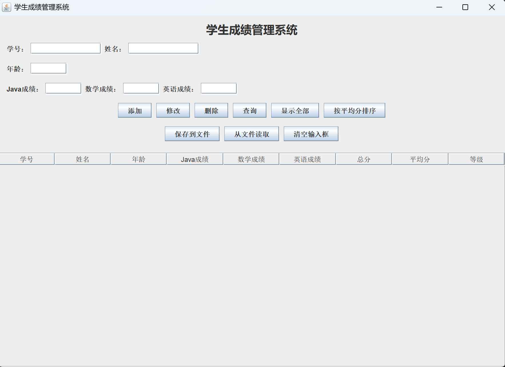
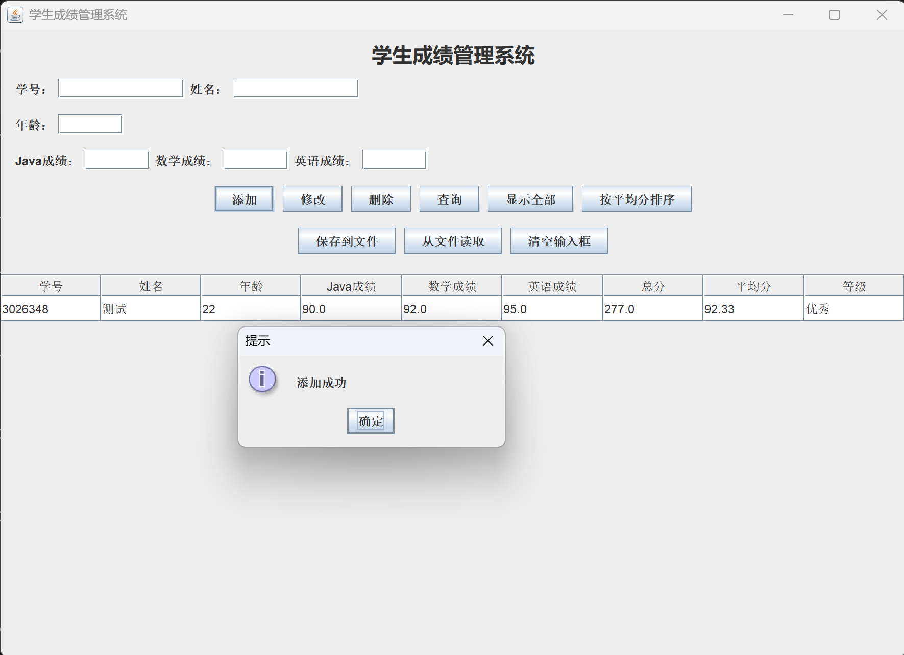
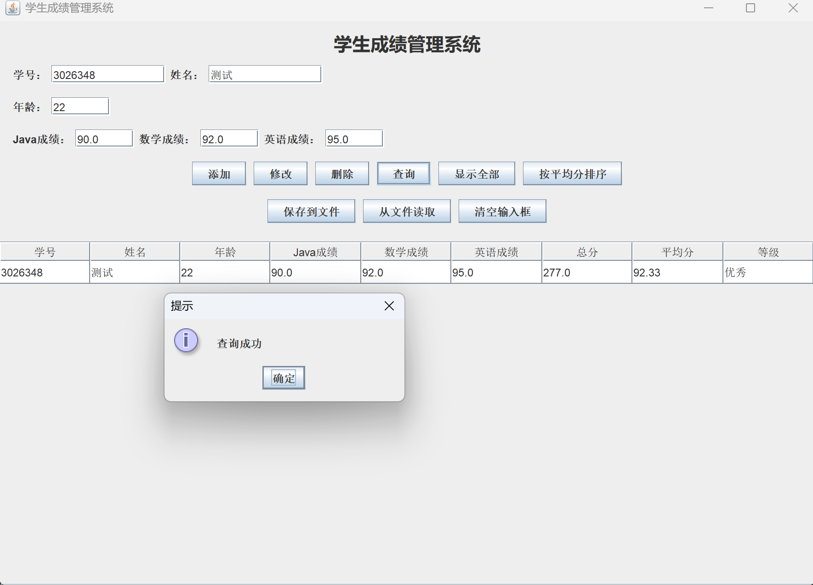
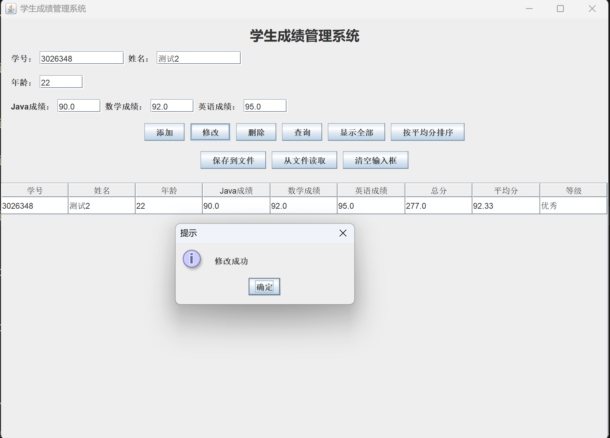
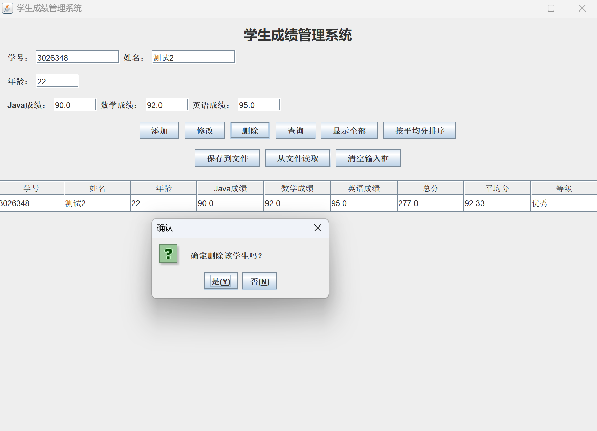
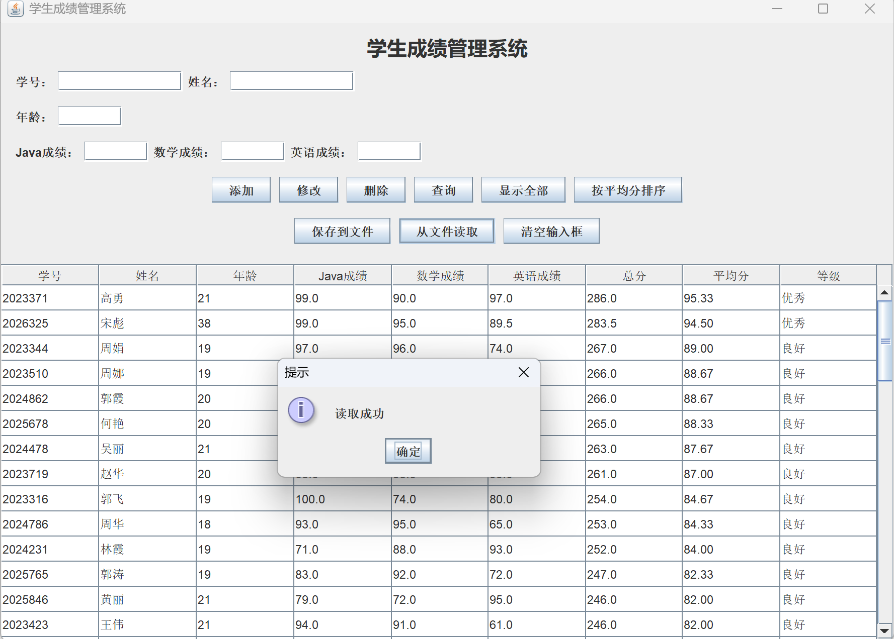

# 基于 Java Swing 的学生成绩管理系统 — 项目说明文档

## 一、项目名称

基于 Java Swing 的学生成绩管理系统

## 二、学生信息

- 学号：
- 姓名：
- 班级：

## 三、项目简介

本项目是一个图形化的学生成绩管理系统。用户通过 Swing 窗口完成学生信息的录入、显示、查询、修改、删除、成绩统计、排序以及文件保存与读取等操作。系统采用本地文本文件 `students.txt` 作为数据存储，不使用数据库。

## 四、功能介绍

1. 添加学生：输入学号、姓名、年龄及三门课成绩，点击「添加」加入系统
2. 修改学生：输入学号及新信息，点击「修改」更新记录
3. 删除学生：输入学号，确认后删除（含确认对话框）
4. 查询学生：输入学号，将学生信息回填至输入框
5. 显示全部：在 JTable 中展示所有学生及总分、平均分、等级
6. 按平均分排序：按平均分从高到低排序并刷新表格
7. 保存到文件：将当前数据写入 `students.txt`
8. 从文件读取：从 `students.txt` 加载数据并显示
9. 清空输入框：清除所有输入字段

**输入校验规则：**

- 学号、姓名不能为空；学号不可重复
- 年龄必须为正整数
- 成绩必须为数字，范围 0~100

**等级规则：**

- 平均分 >= 90：优秀
- 平均分 >= 80：良好
- 平均分 >= 70：中等
- 平均分 >= 60：及格
- 平均分 < 60：不及格

## 五、类的设计说明


| 类名                    | 职责                                                          |
| --------------------- | ----------------------------------------------------------- |
| `ScoreCalculator`（接口） | 定义成绩计算契约：`getTotalScore()`、`getAverageScore()`、`getLevel()` |
| `Student`（类）          | 封装学生属性，实现成绩计算                                               |
| `ExcellentStudent`（类） | 继承 `Student`，扩展 `reward` 字段，体现继承                            |
| `StudentManager`（类）   | 使用 `ArrayList<Student>` 管理数据，提供增删改查与排序                      |
| `FileUtil`（工具类）       | 负责 `students.txt` 的读写                                       |
| `StudentFrame`（类）     | Swing 图形界面，处理用户交互                                           |
| `Main`（类）             | 程序入口，在 EDT 线程中启动界面                                          |


**类关系：**

```
ScoreCalculator <|.. Student <|-- ExcellentStudent
StudentFrame --> StudentManager --> Student
FileUtil --> Student
```

## 六、使用的 Java 知识点

- 面向对象：封装、继承、多态、接口
- 集合框架：ArrayList、Comparator 排序
- IO 流：BufferedReader、BufferedWriter、FileReader、FileWriter
- 异常处理：try-with-resources、IOException、RuntimeException
- Swing GUI：JFrame、JPanel、JLabel、JTextField、JButton、JTable、DefaultTableModel、JScrollPane、JOptionPane
- 事件处理：ActionListener（Lambda 表达式）
- 布局管理器：BorderLayout、FlowLayout、GridLayout

## 七、文件读写说明

- **文件名：** `students.txt`（位于 `src` 目录，与源代码同级）
- **编码：** UTF-8
- **格式：** 每行一条记录，逗号分隔六个字段

示例：

```
2024001,张三,19,88,92,85
2024002,李四,20,76,81,79
```

- **保存：** 点击「保存到文件」，将内存中全部学生写入 `students.txt`
- **读取：** 点击「从文件读取」，解析文件并替换内存数据，刷新表格
- **文件不存在时：** 读取返回空列表，不报错

## 八、运行方式

```bash
cd src
javac *.java
java Main
```

## 九、运行结果截图


### fig1：系统主界面


### fig2：添加学生成功


### fig3：查询学生


### fig4：修改学生信息


### fig5：删除学生


### fig6：读取文件



## 十、项目总结

通过本项目，掌握了 Java Swing 图形界面开发的基本流程，以及面向对象设计中「模型 - 管理 - 持久化 - 界面」的分层思想。接口 `ScoreCalculator` 定义计算规范，`Student` 负责数据与计算，`StudentManager` 负责业务逻辑，`FileUtil` 负责文件 IO，`StudentFrame` 负责用户交互，各层职责清晰、耦合度低，便于维护和扩展。